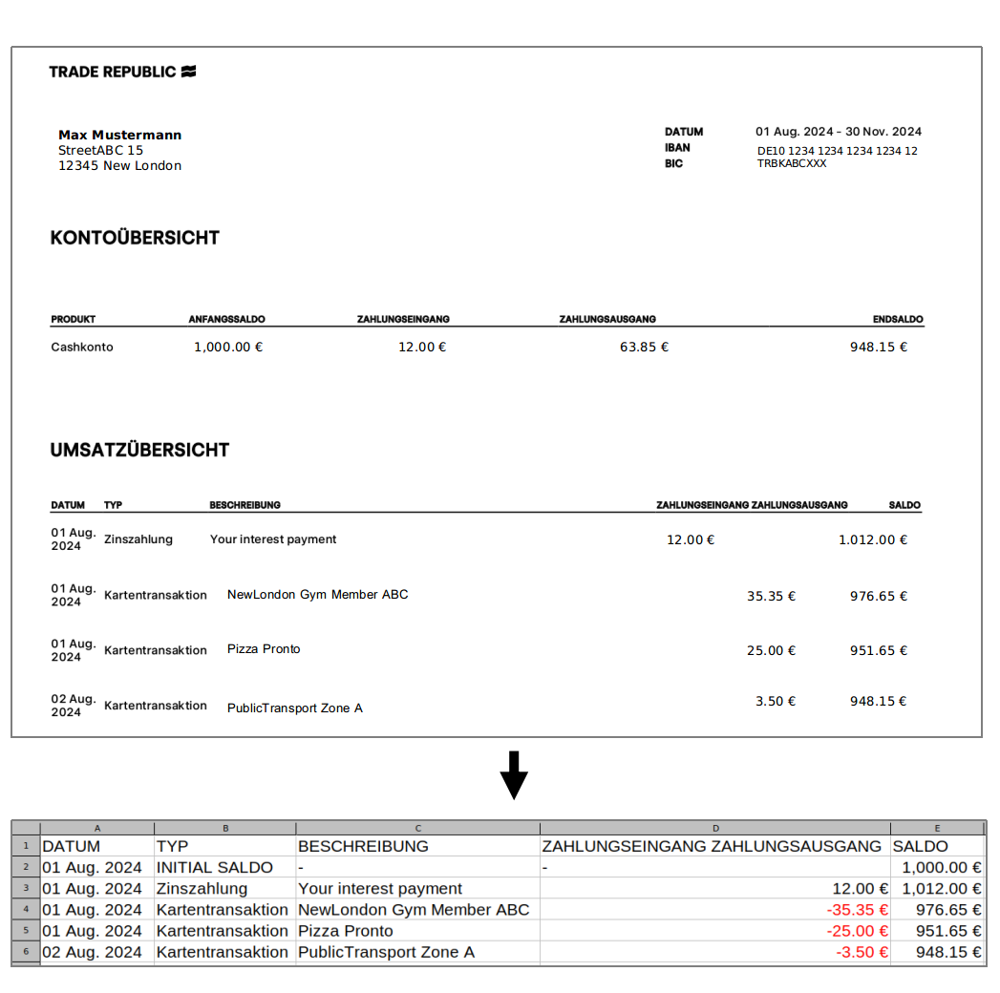

# trade_repubic_pdf2csv

### Python-based conversion of TradeRepublic account statements from .pdf to .csv.


## How to?
Make sure your python environment has the required packages installed as listed in the requirments.txt file. 
Then, save your pdf-statement-files in the pdf-files-folder and the tr_pdf_to_csv.py within the given directory:
```
python tr_pdf_to_csv.py
```
If everything goes well, you'll find the converted .csv-files in the respective csv_files-folder.